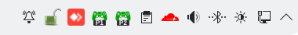

# DS4 Battery Monitor 🎮🔋
 
 

  

 
A lightweight and efficient battery monitor for DualShock 4 controllers on Linux. It displays dynamic icons in the system tray, allowing you to quickly identify battery levels and which specific controller (P1, P2, etc.) is being monitored.
 
 

✨ Features

    Multi-Controller Support: Automatically identifies and monitors multiple controllers simultaneously.

    Dynamic Mapping: Assigns IDs (P1, P2...) based on connection order, keeping your tray organized.

    High-Visibility Interface: Custom-scaled icons (56px) designed to align perfectly with standard system tray icons.

    UDP-Based Architecture: Uses a socket-based approach for fast updates and extremely low resource consumption.

    Auto-Cleanup: Icons are automatically removed from the tray when a controller is disconnected.
 

🛠️ Driver Compatibility

The monitor is designed to be versatile, working with two primary data sources:

  **Native Kernel Drivers:** Automatically scans /sys/class/power_supply/ to detect controllers paired via native Linux Bluetooth drivers.

  **Custom ds4drv:** Fully compatible with the [modified version of ds4drv](https://github.com/Jonatas-Goncalves/ds4drv). The monitor accepts UDP packets sent by this driver, making it ideal for users utilizing it for advanced mapping or emulation.
 

📊 Battery States & Icons

Icons change color and shape based on the charge level reported by the drivers for easy visual recognition:
Icon	Charge Level	Description
 
 
🟢	> 75%	Full Battery
 
 
🟡	50% - 75%	Medium Battery
 
 
🟠	11% - 49%	Low Battery
 
 
🔴	< 10%	Critical Level
 
 

🚀 Installation & Usage
Dependencies

    Python 3.x

    pystray

    Pillow (PIL)

    Liberation Fonts (Found in openSUSE as liberation-fonts)

How to Run

    Clone the repository:
    Bash

    git clone https://github.com/Jonatas-Goncalves/ds4-battery-monitor.git
    cd ds4-battery-monitor

    Run the script:
    Bash

    python3 ds4-battery-monitor.py

Autostart (Systemd)
 
 

For openSUSE, Fedora, or Arch users, you can enable the user service to start automatically with your session:
Bash
 
systemctl --user enable --now ds4-battery-monitor.service

 

🔧 Technical Configuration
 

The monitor listens on 127.0.0.1 at port 54321 by default. It expects UDP messages in the format ID:PERCENTAGE, where the ID can be the end of a MAC address or a numeric identifier sent by ds4drv.

 
 

Developed by [Jonatas Gonçalves] Maintained on [openSUSE Tumbleweed](https://build.opensuse.org/package/show/games:tools/ds4-battery-monitor) 🦎
