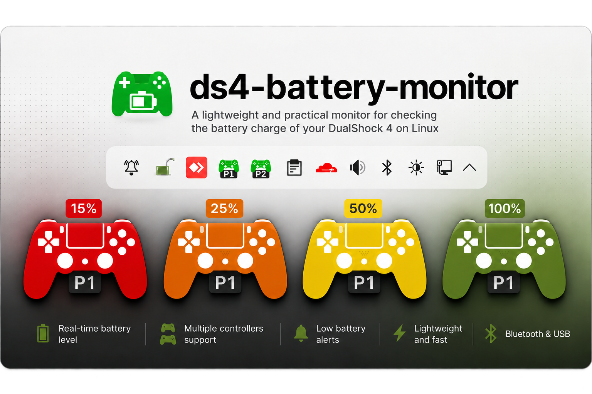

# DS4 Battery Monitor 🎮🔋
<br>
<br>
<p align="center">
  
</p>
<br>
A lightweight and efficient battery monitor for DualShock 4 controllers on Linux. It displays dynamic icons in the system tray, allowing you to quickly identify battery levels and which specific controller (P1, P2, etc.) is being monitored.
<br>
<br>

✨ Features


    - Multi-Controller Support  
      Automatically identifies and monitors multiple controllers simultaneously.

    - Dynamic Player Mapping  
      Assigns IDs (P1, P2...) based on connection order.

    - Native Linux Tray Integration  
      Uses GTK3 + AyatanaAppIndicator for better compatibility with modern Linux desktop environments.

    - High Quality Cairo Rendering  
      Dynamically renders tray icons with smooth scaling and controller labels.

    - Low Battery Rumble Alerts  
      Controllers vibrate automatically when reaching low battery thresholds (50%, 25%, and 15%).

    - Force Feedback Support (evdev)  
      Uses native Linux FF/rumble support through evdev.

    - Automatic Controller Detection  
      Detects compatible controller event devices automatically using MAC address matching.

    - Flatpak Support  
      Includes Flatpak-aware paths and automatic autostart integration.

    - UDP-Based Architecture  
      Lightweight socket-based communication with minimal CPU/RAM usage.

    - Auto Cleanup  
      Automatically removes disconnected controllers and cleans unused resources.
<br>

🛠️ Driver Compatibility

The monitor is designed to be versatile, working with two primary data sources:

  **Native Kernel Drivers:** Automatically scans /sys/class/power_supply/ to detect controllers paired via native Linux Bluetooth drivers.

  **Custom ds4drv:** Fully compatible with the [modified version of ds4drv](https://github.com/Jonatas-Goncalves/ds4drv). The monitor accepts UDP packets sent by this driver, making it ideal for users utilizing it for advanced mapping or emulation.
  
  **Force Feedback / Rumble:**  
  Low battery vibration alerts require a controller/device exposing EV_FF support through evdev.
<br>
<br>
📊 Battery States & Icons

Icons change color and shape based on the charge level reported by the drivers for easy visual recognition:
Icon	Charge Level	Description
<br>
<br>
🟢	> 75%	Full Battery
<br>
<br>
🟡	50% - 75%	Medium Battery
<br>
<br>
🟠	16% - 49%	Low Battery
<br>
<br>
🔴	< 15%	Critical Level
<br>
<br>

🔔 Low Battery Alerts

The monitor can trigger native controller rumble alerts when battery levels become low.

Alert patterns:

    - 50% → 3 sequences of 2 pulses
    - 25% → 3 sequences of 3 pulses
    - 15% → 4 sequences of 4 pulses

Requires:

    - Linux evdev support
    - EV_FF compatible controller device
    - Force feedback enabled driver

📦 Flatpak Support

The application includes native Flatpak support:

    - Automatic icon path detection
    - Automatic desktop autostart setup
    - Sandboxed resource handling
    
🚀 Installation & Usage

Dependencies

    - Python 3.x
    - GTK3
    - AyatanaAppIndicator
    - python3-evdev
    - python3-cairo
    - Liberation Fonts

How to Run

    Clone the repository:
    Bash

    git clone https://github.com/Jonatas-Goncalves/ds4-battery-monitor.git
    cd ds4-battery-monitor

    Run the script:
    Bash

    python3 ds4-battery-monitor.py

Autostart (Systemd)
<br>
For openSUSE, Fedora, or Arch users, you can enable the user service to start automatically with your session:
Bash
<br>
systemctl --user enable --now ds4-battery-monitor.service

<br>

🔧 Technical Configuration
<br>
The monitor listens on:

    - IP: `127.0.0.1`
    - Port: `54321`

Expected UDP packet format:

    ```text
    ID:PERCENTAGE

<br>
<br>


Developed by [Jonatas Gonçalves](https://www.linkedin.com/in/jonatasgon%C3%A7alves/)
<a href="https://www.linkedin.com/in/jonatasgon%C3%A7alves/">
  
</a>
<br>
Maintained on [openSUSE Tumbleweed](https://build.opensuse.org/package/show/games:tools/ds4-battery-monitor) 🦎
